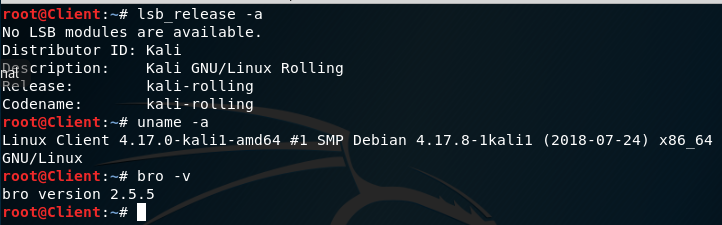
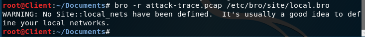
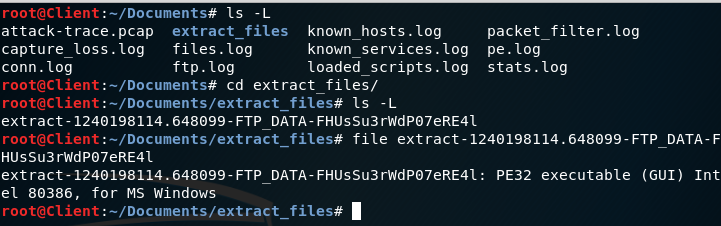

# chap0x0C 实战bro网络入侵取证

----------

## 实验目的
* 下载课程提供的[PCAP](http://sec.cuc.edu.cn/huangwei/textbook/ns/chap0x12/attack-trace.pcap)包，使用bro来完成取证分析。
## 实验环境
* 虚拟机
	<pre>
	名称：Client
	网卡：eth0
	IP：10.0.2.5
	</pre>
* 
## 实验过程
* 安装bro`apt-get install bro`
* 编辑bro配置文件
	* 在`/etc/bro/site/`目录下创建新文件`mytuning.bro`,添加配置代码
		* `redef ignore_checksums = T;`
		* 含义：bro不会分析没有有效校验和的数据包。如果网卡开启Checksum Offload选项，则网卡会负责计算发送/收到的数据包的校验和，这会导致本地捕获/发送的数据包有错误的校验和(因为数据包在到达网卡前系统会在校验和字段填写随机数)。配置此行代码让Bro进行分析时忽略校验和验证。
	* 编辑 `/etc/bro/site/local.bro`,添加配置代码
		* `@load frameworks/files/extract-all-files`
		* `@load mytuning.bro`
		* 含义：第一条是启用bro自带的文件提取规则。第二条是启用刚才新添加的规则。
* 使用bro自动化分析下载的pcap文件
	* `bro -r attack-trace.pcap /etc/bro/site/local.bro`
		* 出现警告信息
		* 
		* 解决方式：编辑`mytuning.bro`，添加变量定义`redef Site::local_nets = { 192.150.11.0/24 };`
* 开始分析
	* 执行刚才的bro自动化分析指令后在attack-trace.pcap所在的目录下生成了一些.log文件和一个extract_files目录。查看extract_files目录中文件类型是一个可执行文件：
		* <pre>
		root@Client:~/Documents/extract_files# file extract-1240198114.648099-FTP_DATA-FHUsSu3rWdP07eRE4l 
		extract-1240198114.648099-FTP_DATA-FHUsSu3rWdP07eRE4l: PE32 executable (GUI) Intel 80386, for MS Windows
		</pre>
		* 
	* 将该文件上传至[virustotal](https://virustotal.com/)发现匹配了一个[历史扫描报告](https://www.virustotal.com/#/file/b14ccb3786af7553f7c251623499a7fe67974dde69d3dffd65733871cddf6b6d/detection)，报告表明这是一个已知的后门程序。
* 逆向倒推入侵线索
	* 通过阅读`/usr/share/bro/base/files/extract/main.bro`的源码可以知道该文件的命名规则。
	<pre>
	function on_add(f: fa_file, args: Files::AnalyzerArgs)
		{
		if ( ! args?$extract_filename )
			args$extract_filename = cat("extract-", f$last_active, "-", f$source,
			                            "-", f$id);
		f$info$extracted = args$extract_filename;
		args$extract_filename = build_path_compressed(prefix, args$extract_filename);
		f$info$extracted_cutoff = F;
		mkdir(prefix);
		}
	</pre>
	* 该文件名的最右`-`右侧字符串`FHUsSu3rWdP07eRE4l`是`files.log`中的文件唯一标识。
	* 查看`file.log`中该字段对应的信息
		* `root@Client:~/Documents# cat files.log | grep -e FHUsSu3rWdP07eRE4l -e tx_hosts`
		* 分析打印结果可知该PE文件的发送者是`IP:98.114.205.102`的主机
		<pre>
		/#fields	ts	fuid	tx_hosts	rx_hosts	conn_uids	source	depth	analyzers	mime_type	filename	duration	local_orig	is_orig	seen_bytes	total_bytes	missing_bytes	overflow_bytes	timedout	parent_fuid	md5	sha1	sha256	extracted	extracted_cutoff	extracted_size
		1240198114.648099	FHUsSu3rWdP07eRE4l	98.114.205.102	192.150.11.111	CDv7nk2O4Q6K7uaOgb	FTP_DATA	0	PE,EXTRACT,MD5,SHA1	application/x-dosexec	-	9.767306	F	T	158720	-	0	0	F	-	14a09a48ad23fe0ea5a180bee8cb750a	ac3cdd673f5126bc49faa72fb52284f513929db4	-	extract-1240198114.648099-FTP_DATA-FHUsSu3rWdP07eRE4l	F	-
		</pre>
	* 至此，实验完成。
## 参考资料
* [TCP Checksum Offload](https://zh.wikipedia.org/wiki/TCP校验和卸载)
* [why-isn-t-bro-producing-the-logs-i-expect-a-note-about-checksums](https://www.bro.org/documentation/faq.html#why-isn-t-bro-producing-the-logs-i-expect-a-note-about-checksums)