# chap0x01 基于VirtualBox的网络攻防基础环境搭建
## 一 .实验环境
* 靶机
	* 名称：Victim
	* 网络模式：内部网络(eth0)
	* eth0 IP：192.168.56.102/24
	* 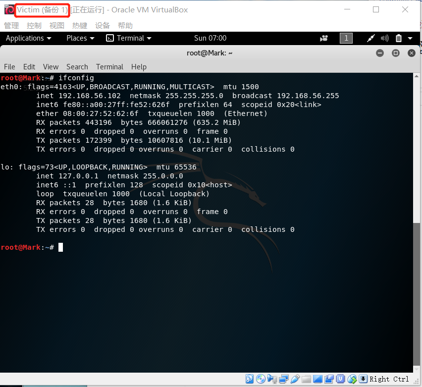
* 网关
	* 名称：Gateway
	* 网络模式：NAT network(eth0),内部网络(eth1)
	* eth0 IP：10.0.2.15/24
	* eth1 IP：192.168.56.101/24
	* 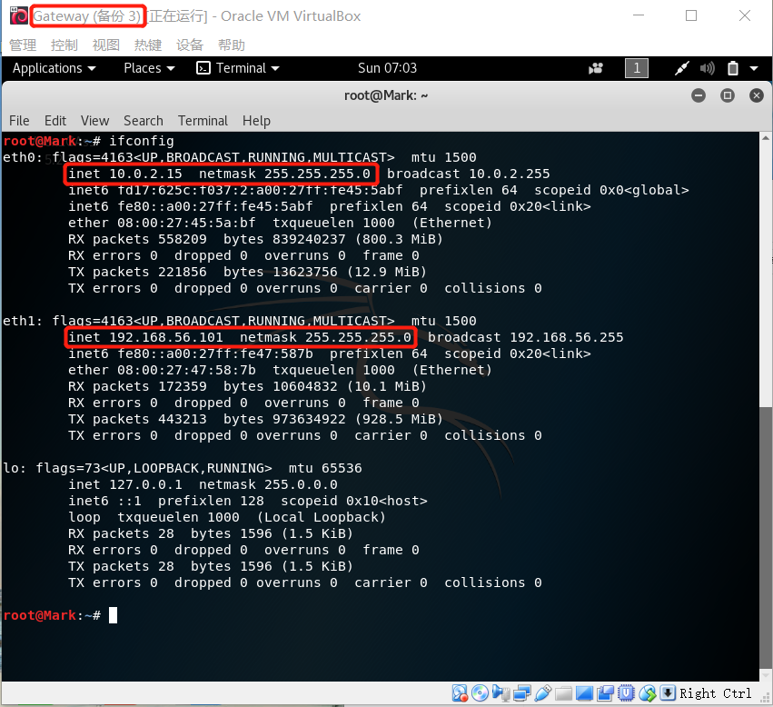
* 攻击者主机
	* 名称：Attacker
	* 网络模式：NAT network(eth0)
	* eth0 IP：10.0.2.5/24
	* 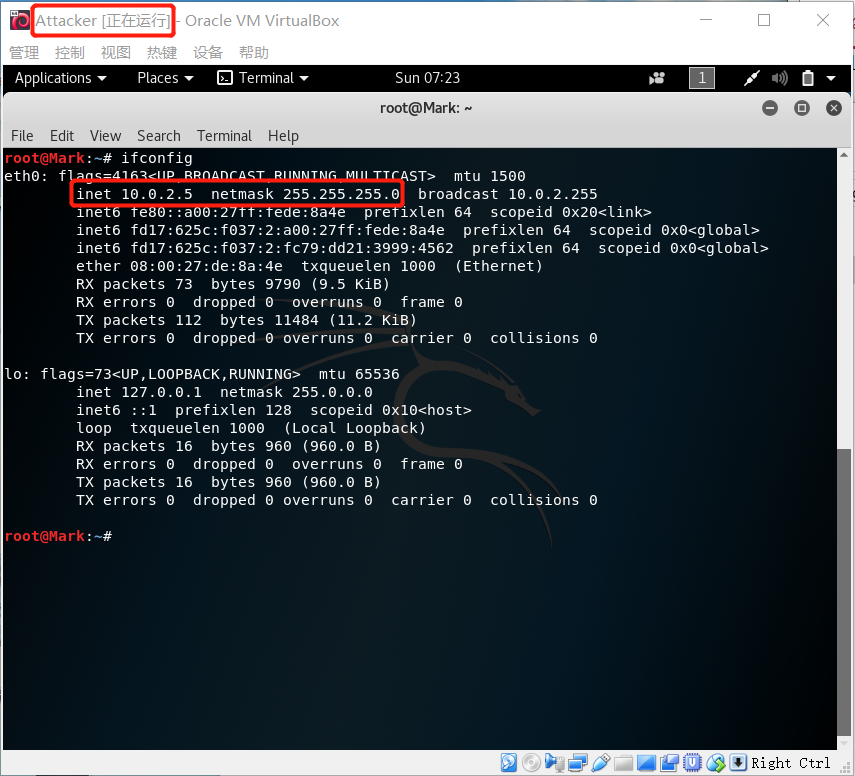
* 网络拓扑图
	* 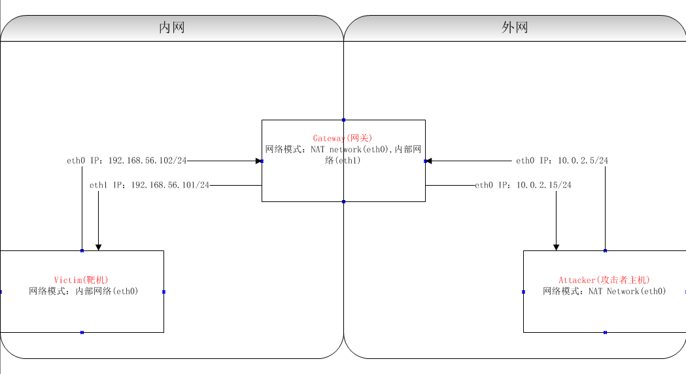
## 二 .实验方案及过程
### Step1：Attacker使用NAT network模式
* 访问互联网及网关
### Step2：Victim使用内网模式
* Attacker无法直接访问靶机
### Step3：Gateway网卡1使用NAT network模式，网卡2使用内网模式，配置IP与靶机在同一网段
* 通过eth0访问互联网及攻击者主机
* 通过eth1与靶机互相访问
### Step4：配置Victim的IP路由表
* 靶机的所有流量对外上下行流量经过网关
	* 配置命令 
		<pre>root@Mark:~# route add default gw 192.168.56.101</pre>
	* 结果 
		<pre>root@Mark:~# ping 223.6.6.6</pre>
		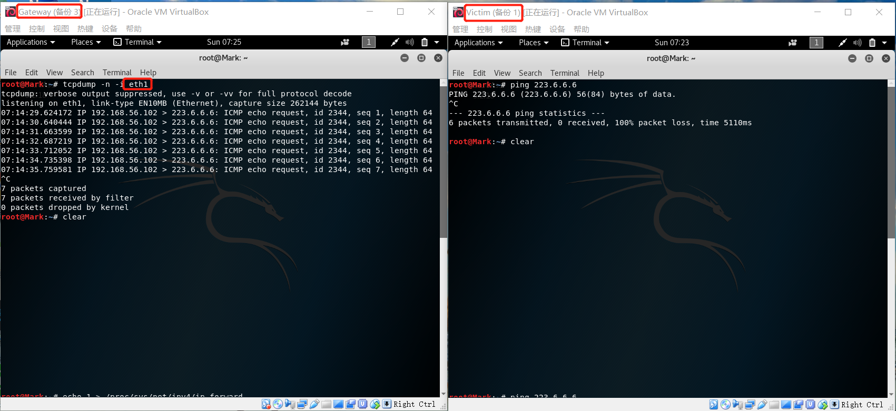
### Step5：开启Gateway的数据转发功能
* eth1收到的数据包转发给eth0
	* 配置命令 
		<pre>root@Mark:~# echo 1 > /proc/sys/net/ipv4/ip_forward</pre>
	* 结果 
		<pre>root@Mark:~# cat /proc/sys/net/ipv4/ip_forward</pre>
		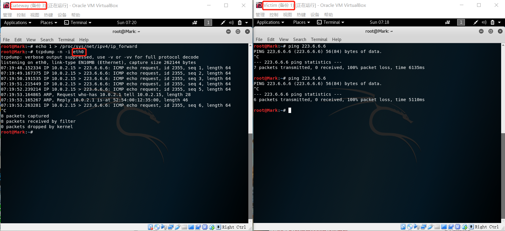
### Step6：配置Gateway的NAT，将eth1接收的特定网段下的数据包伪装后转发出去
* 实现靶机访问互联网
	* 配置命令
		* 导出iptables表
			<pre>root@Mark:~# iptables-save -c >iptables.rules</pre>
		* 向导出表中添加命令
			<pre>-A POSTROUTING -s 192.168.56.0/24 -o eth0 -j MASQUERADE</pre>
		* 写入iptables表
			<pre>root@Mark:~# iptables-restore < iptables.rules</pre>
	* 结果
		<pre>root@Mark:~# iptables -n -t nat -L</pre>
		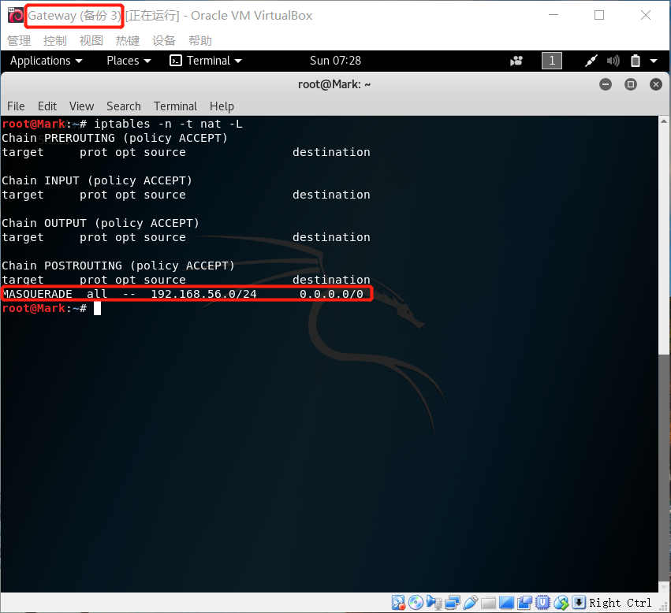
		<pre>root@Mark:~# ping 223.6.6.6</pre>
		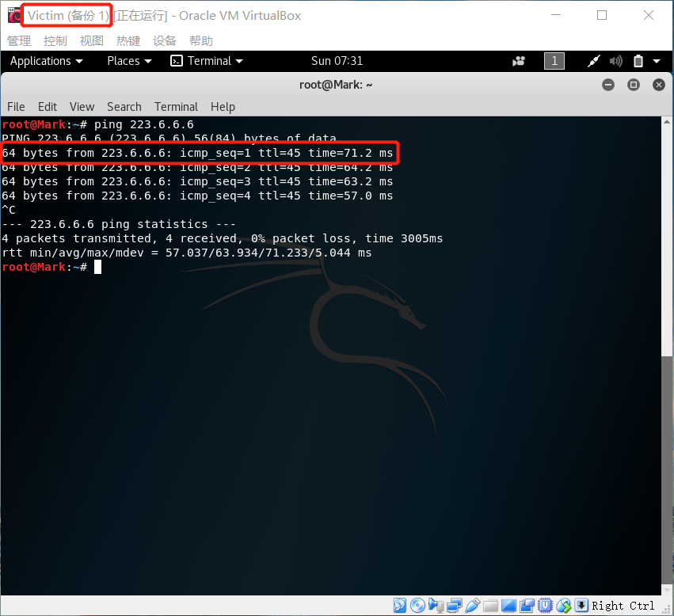
		<pre>root@Mark:~# tcpdump -n -i eth1</pre>
		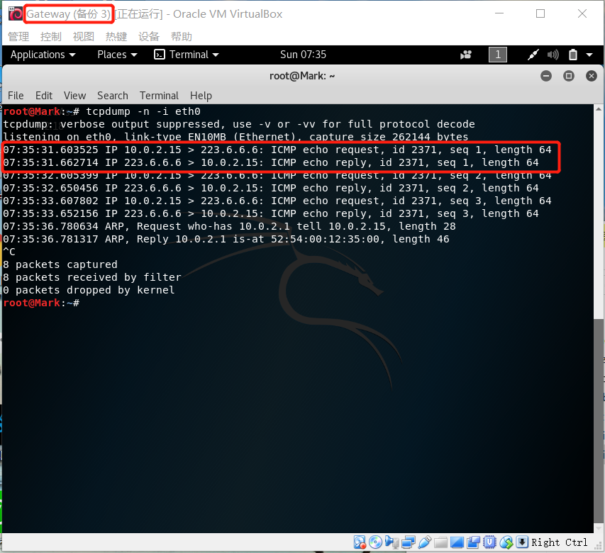
### step7：用靶机ping攻击者主机&用攻击者主机ping靶机
* 用靶机ping攻击者主机 成功
	<pre>root@Mark:~# ping 10.0.2.5</pre>
	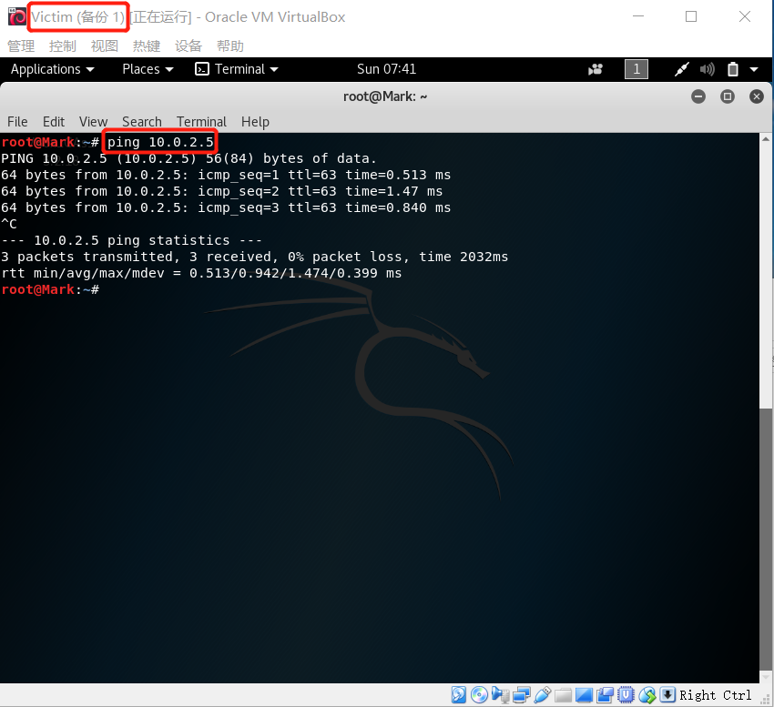
* 用攻击者主机ping靶机 失败
	<pre>root@Mark:~# ping 192.168.56.102</pre>
	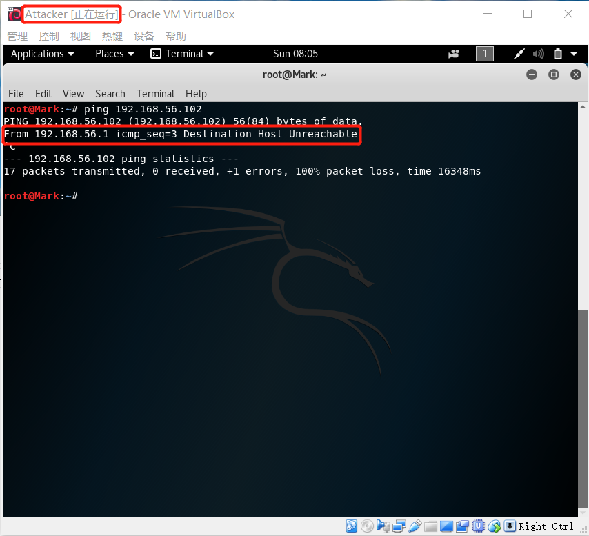
### step8：网关访问攻击者主机和靶机
* 用网关ping攻击者主机 成功
	<pre>root@Mark:~# ping 10.0.2.5</pre>
	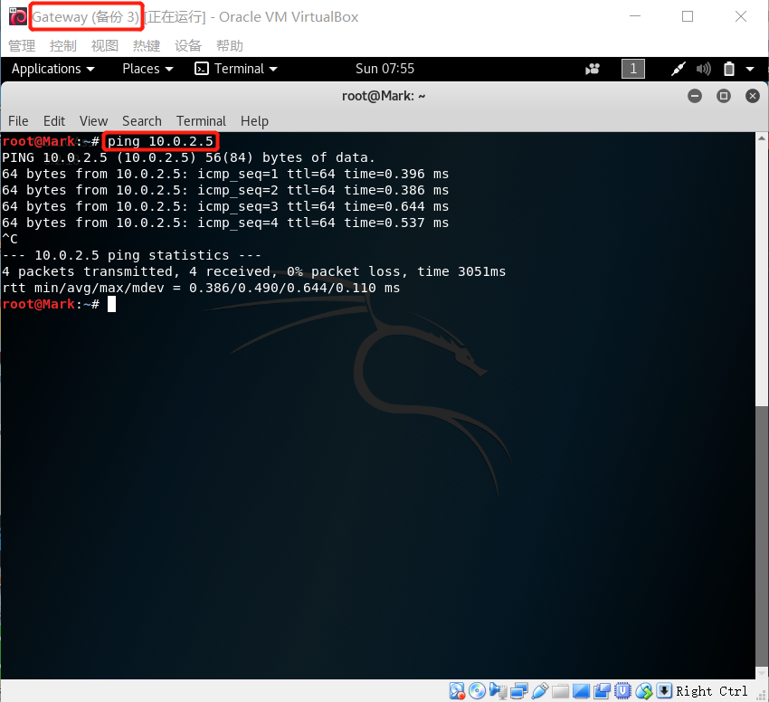
	
* 用网关ping靶机 成功
	<pre>root@Mark:~# ping 192.168.56.102</pre>
	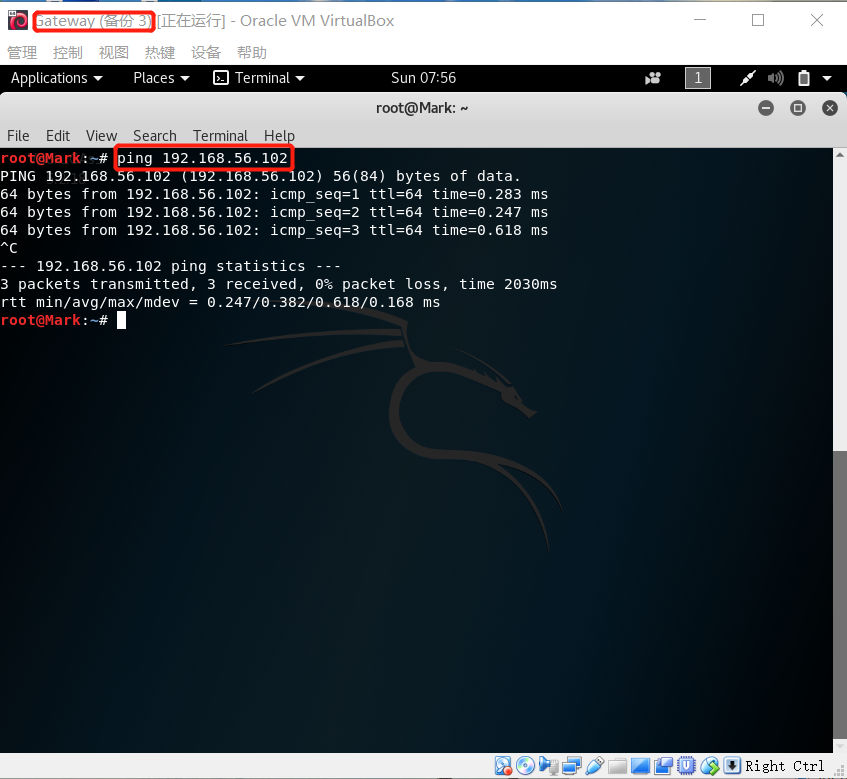
	
## 三 .遇到的问题
* 完成上述步骤后，靶机只能通过ping IP地址才能访问互联网，所以认为是域名解析出现问题。
	* 参考网址<pre>https://blog.csdn.net/zouqingfang/article/details/52161976</pre>
	* 配置指令<pre>echo 'nameserver 223.6.6.6' > /etc/resolv.conf</pre>
	* 结果
		<pre>root@Mark:~# ping www.baidu.com</pre>
		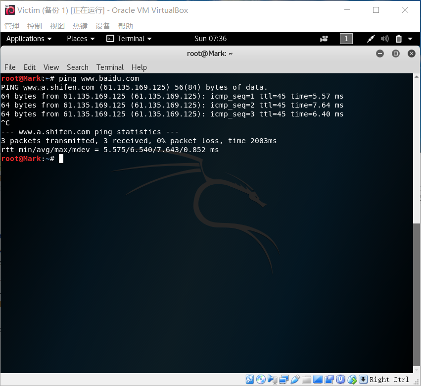
* Gateway和Victim使用内网模式的网卡开机后没有IP地址。
	* 解决方式 静态分配IP地址
	* 配置指令
		<pre>root@Mark:~# vi /etc/network/interfaces</pre>
		向文件中配置静态IP<pre>auto eth1
		iface eth1 inet static
		address 192.168.56.101
		netmask 255.255.255.0
		</pre>